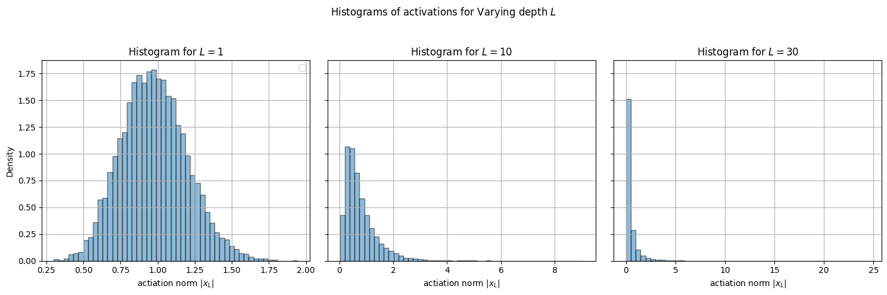
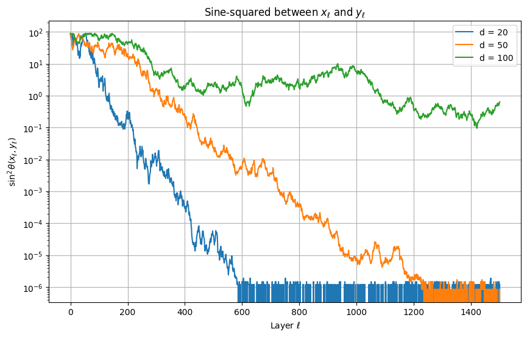
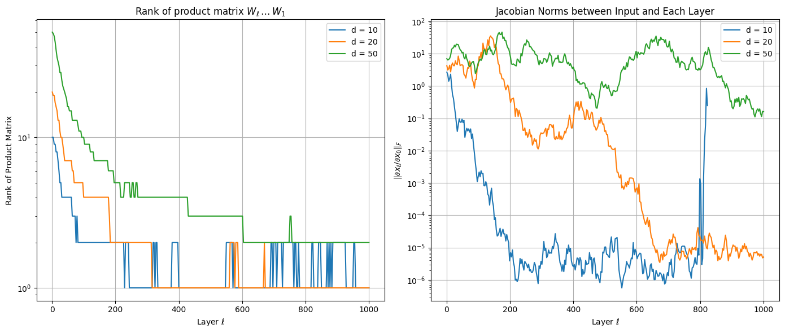

# New 

Let $\kappa$ be the kernel map satisf                        ying $\kappa(1)=1.$ Define the kernel sequence $\rho_{\ell+1}=\kappa(\rho_\ell),$ with initial step $\rho_0 \in (-1,1).$ Assuming that the activation is non-linear, there is a unique $\rho^*\in[-1,1]$ such that $\kappa(\rho^*) = \rho^*,$ and $\kappa'(\rho^*) < 1,$ with absolute constant $\beta < 1$ that depends on the activation only, such that 
$$
|\rho_\ell-\rho^*| \le \frac{|\rho_0-\rho^*|}{1-|\rho_0|}\beta^\ell
$$

The value of $\beta$ is given for two cases:

1. $\kappa(0)=0$, then $\rho^*=0$ and  $\beta = 1/\kappa'(1)$ suffices. 
2. $\kappa(0) > 0,$ then $\rho^*$ is necessarily $\rho^*>0,$ and we have $\beta = \max\{1-c_0^2,\kappa'(\rho^*),1/\kappa'(1)\}$ where 

**Proof**
The main strategy is to prove some type of contraction of $\kappa(\rho)$ towards $\rho^*$, under the kernel map $\kappa$. In other words, we need to show $|\kappa(\rho)-\rho^*|$ is smaller than $|\rho-\rho^*|$ under some potential. To prove this contraction, we consider three cases: 1) If $\rho > \rho^*$, 2) If $\rho \in [0,\rho^*]$, and 3) If $\rho < 0$. However, the bounds will be of different potential forms, and have to be combined later. 

Let $\kappa(\rho) = \sum_{k=0}^\infty c_k^2 \rho^k$ be the kernel map with $\kappa(1)= 1.$ with fixed-point $\rho^*.$ 

**Case 1: if $\rho\ge \rho^*$** we will prove:
$$
\frac{|\kappa(\rho)-\rho^*|}{1-\kappa(\rho)} \le \frac{|\rho-\rho^*|}{1-\rho} \kappa'(\rho^*)
$$

We have the series expansion around $\rho^*$: $\kappa(\rho) = \rho^* + \sum_{k=1}^\infty a_k (\rho-\rho^*)^k.$ For points $\rho\ge \rho^*,$ we will have $\kappa(\rho)\ge \rho^*,$ thus we can write

$$
\begin{align*}
\frac{\kappa(\rho)-\rho^*}{1-\rho^*-(\kappa(\rho^*)-\rho^*)} &= \frac{\sum_{k=1}a_k (\rho-\rho^*)^k}{\kappa(1)- \kappa(\rho^*)}\\
&= \frac{\sum_{k=1}a_k y^k}{\sum_{k=1}^\infty a_k (1-\rho^*)^k - \sum_{k=1}^\infty a_k y^k} && y:=\rho-\rho^* \\
&= \frac{y\sum_{k=1}^\infty a_k y^{k-1}}{\sum_{k=1}^\infty a_k (1-\rho^* - y)(\sum_{i=0}^{k-1}(1-\rho^*)^iy^{k-1-i})} \\
&= \frac{y}{1-\rho^*-y}\frac{\sum_{k=1}^\infty a_k y^{k-1}}{\sum_{k=1}^\infty a_k (\sum_{i=0}^{k-1}(1-\rho^*)^iy^{k-1-i})} \\
\end{align*}
$$
Now, because we can view the numerator and denominator as weighted sumes, with $a_k$ as weights, and considering that the ratio between $y^{k-1}$ and the correspnd
Thus we can conclude
$$
\rho \ge \rho^* \implies \frac{|\kappa(\rho)-\rho^*|}{1-\kappa(\rho)} \le \frac{|\rho-\rho^*|}{1-\rho} \alpha, \qquad \alpha:= \frac{1}{2-\kappa'(\rho^*)}
$$

**Case 2: $0\le \rho \le \rho^*$**
Now, consider $\rho \in [0,\rho^*].$ For these $k'(\rho)$ is always monotonically increasing, implying that $k'(\rho)\le k'(\rho^*)  < 1.$ Thus, $|\kappa(\rho)-\rho^*| \le k'(\rho^*) |\rho - \rho^*|.$ Thus we can write:
$$
0\le \rho \le \rho^* \implies |\kappa(\rho) - \rho^*| \le k'(\rho^*) |\rho-\rho^*|
$$

**Case 3: $-1 \le \rho \le 0$**
Finally, let us consider $\rho \le 0.$ Recall that we have $\kappa(1) = 1.$ Thus, we can write 
$$
k(\rho) = 1 + (\rho-1)q(\rho), \quad q(\rho) = \sum_{k=0}^\infty b_k \rho^k.
$$

 In fact, we can expand $\kappa(\rho)$ in terms of these new coefficients
$$
\kappa(\rho) = 1-b_0 + \sum_{k=0}^\infty (b_k - b_{k+1}) \rho^k
$$
Due to non-negativity of coefficients of $\kappa$ we can conclude $1\ge b_0 \ge b_1 \ge ... .$ Based on this observation, for $0 < \rho < 1$ we can conclude $
$q(-\rho) = b_0 - b_1 \rho + b_2 \rho^2 - ... \le b_0.$ B because we can pair each odd and even term $-b_{k}\rho^k + b_{k+1} \rho^{k+1} $ for all odd $k, $ and because coefficients $b_k \ge b_{k+1}$ and $\rho^{k} \ge \rho^{k+1}$ for $\rho \in [0,1],$ we can argue $q(-\rho) \le b_0 = 1 - c_0^2.$  Now plugging this value into kernel map for $0 < \rho < 1$ we have:
$$
\begin{align*}
\kappa(-\rho) = 1 - (1+\rho)q(-\rho) \\
\ge 1-(1+\rho)(1-c_0^2)\\
= 1 - 1 - \rho - c_0^2 (1+\rho)\\
\implies \kappa(-\rho) + \rho \ge c_0^2 (1+\rho)\\
\implies -\rho + c_0^2(1+\rho) \le \kappa(-\rho) \le \kappa(\rho)
\end{align*}
$$
Thus, we can conclude that if $\rho \le 0$ and $\kappa(-\rho) \le \rho^*$ then
$$
\frac{|\kappa(\rho)-\rho^*|}{|-\rho-\rho^*|}=\frac{\rho^* - \kappa(-\rho)}{\rho^* + \rho} \le \frac{\rho^* + \rho - c_0^2 (1+\rho)}{\rho+\rho^*} = 1- \frac{c_0^2(1+\rho)}{\rho+\rho^*} \le 1-c_0^2
$$
Now, if we assume $\kappa(-\rho) \ge \rho^*,$ knowing that $\kappa(-\rho)\le \kappa(\rho),$ which necessitates $\rho\ge \rho^*,$ which implies $\kappa(\rho)\le \rho.$ Thus, we have
$$
\frac{|\kappa(-\rho)-\rho^*|}{|-\rho-\rho^*|} = \frac{\kappa(-\rho)-\rho^*}{\rho+\rho^*}\le \frac{\kappa(\rho)-\rho^*}{\rho+\rho^*} \le \frac{\rho-\rho^*}{\rho+\rho^*} \le \frac{1-\rho^*}{1+\rho^*} \le 1-\rho^*
$$ 
Combining both cases we have 
$$
\rho \le 0 \implies \frac{|\kappa(\rho)-\rho^*|}{|\rho-\rho^*|} \le 1 - \min(c_0^2 , \rho^*)
$$

Let us now define the joint decay rate:
$$
\beta = \max\left\{1 - c_0^2, 1-\rho^*, \kappa'(\rho^*)\right\}
$$
In other words, this is the worst case rate for any of the above cases. 

Now, let us assume we are starting from initial $\rho_0,$ and define $\rho_\ell = \kappa(\rho_{\ell-1}).$ Let $\rho_0$ be the first index that we have $\rho_\ell \ge 0.$ Thus we can write:
$$
|\rho_\ell - \rho^*| \le |\rho_0 - \rho^*| \beta^\ell
$$
Now, if we have $\rho_\ell \in [0,\rho^*]$ from $\rho_\ell$ onwards, we can argue based on case 2: 
$$
|\rho_L - \rho^*| \le |\rho_\ell - \rho^*| \beta^{L-\ell} \le |\rho_0-\rho^*|\beta^L
$$
However, if we have $\rho_\ell \ge \rho^*,$ we have to apply case 1:
$$
\frac{|\rho_L-\rho^*|}{1-\rho_L} \le \frac{|\rho_\ell-\rho^*|}{1-\rho_\ell}\beta^{L-\ell}
$$
Now, recall that we always have $|\rho_\ell|\le |\rho_0|.$ Furthermore, we can lower bound the left hand side by 
$$
|\rho_L - \rho^*| \le \frac{|\rho_L -\rho^* }{1- \rho_L} \le \frac{|\rho_\ell-\rho^*|}{1-\rho_\ell}\beta^{L-\ell} \le \frac{|\rho_\ell-\rho^*|}{1-|\rho_0|}\beta^{L-\ell} \le \frac{|\rho_0-\rho^*|}{1-|\rho_0|}\beta^{L}
$$ 
where in the last step we invoke our bound up to step $\ell/$
If we take the worst of these two cases, we have
$$
|\rho_L - \rho^*| \le \frac{|\rho_0 - \rho^*|}{1-|\rho_0|} \beta^L 
$$

# refined analysis of rates
We know that the slope at $\rho^*$ is less than tangent slope at $1$ and more than tangent slope at $0$:
$$
\begin{align}
s = \frac{\rho^*-c_0^2}{\rho^*-0} = 1-c_0^2/\rho^*\\
\kappa'(\rho^*) = \sum_{k=1} k c_k^2 (\rho^*)^{k-1} \\
\kappa'(0) = c_1^2 \\
\kappa'(1) = \sum_{k=1}^\infty k c_k^2 \\
\kappa'(0) \le s \le \kappa'(\rho^*) \le \kappa'(1)\\
c_1^2 \le 1-c_0^2/\rho^* \le \kappa'(\rho^*)\le \sum_{k=1}^\infty (k-1)c_k^2
\end{align}
$$
Another observation is that 
$$
\kappa'(\rho*) = \sum_{k=1}^\infty k c_k (\rho^*)^{k-1}
$$
let us analyze the sequence $kx^{k-1}$ for $x \in (0,1),$ specificially, let's see the ratio of two consequitive elements: 
$$
(k+1)x^{k} \le (k x^{k-1}) \\
\iff (k+1)x^{k}/(k x^{k-1}) < 1\\
\iff (k+1)/k x < 1\\
\iff x < k/(k+1) 
$$
This means that for $k \approx \lfloor x/(1-x)\rfloor $ the term is maximum, which means that the maximum is achieved when $a_k$ is concentrated there. Thus, achieving $k (k/(k+1))^{k-1}.$ Thus, we can find the maximum $k$ by finding index $k$ in the sequence $\{1-1/(k+1)\}$ where the $x$ is between two successive values. For such a $k$ we have
$$
\kappa'(x) \approx k (1+1/k)^{-(k-1)} = k \exp(-(k-1)/k) \approx k \exp(-1)\\
\kappa'(x) \le \frac{1-c_0^2}{e(1-x)}\\
1-c_0^2/\rho^* \le \kappa'(\rho^*)\le \frac{1-c_0^2}{e(1-\rho^*)}
$$ 

Let's expand $\kappa'(x)$:
$$
\kappa'(x) = \sum_{k=1}^\infty c_k^2     (k-1)x^{k-1}
$$

# Matrix products in neural nets 

**Philosophy** 
I came to recognize through various discussions that role of theory in ML/AI, is not only for sake of rigorous theorems, but to ellucidate various mysterious and in effect, demistify the behaviors in neural networks such that they are accessible to the braoder research community. Implicit in this goal is that developing theories with only rigor in mid, will fall short of that goal. Therefore, while most of my theories elaborated here can be derived based on theories developed in several different branches of math, statistics, and computer science, this thesis is an excercise to make all these theories intuitively accissible to myself, and as a byproduct, to anyone with a basic understanding of algebra, calculus, probability, and statistics. 

In neural networks, we often come acorss formulations that involve matrix products. The most straighforward example is a fully connect layer which connects the previous the the next $W_\ell x_\ell$. Another example, which is arguably leading to the longest chain of product appears in Recurrent Neural Networks (RNNs), where the recursive application of a weight $x_{t+1} = x_t + A x_{t-1}$ matrix to the input sequence can lead to arbitrary large matrix powers $x_{t+1} = \sum_{i=1}^t A^i x_{t-i}$, which are a particular form of matrix product. The most prominent example of matrix product appears in application of the chain rule, where each layer input/outputs can be vecotrized, leading to a chain of matrix Jaccobian products. 

While matrix sums and particularly sums of random matrices have been subject of numerous extensive studies in variouas discliplines, matrix products are relatively much harder to analyze and understand. In the case of neural networks, understanding them becomes even more acute, due to various forms of non-linearity and inter-dependencies between units. In this thesis, we present several basic results on understanding and analyzing matrix products as it relates to various neural network modules and architectures. 

We are broadly interested in how the depth of the matrix product chain affects signal forward and backward pass. This depth could correspond roughly to the number of layers in the case of non-recurrent networks, and lenght of the input sequence in the recurrent architectures. In plain words, we want to make sure that the forward and backward pass do not explode nor vanish at an exponential rate in depth, such that we can represent them accurately with floating point representation in CPU or GPU compute units. As we shall see, this objective of trying to keep forward and backward activations reasonably bounded is surprisingly challenging, which has a simple and straighforward description, can be very challenging or even impossible to obtain under certain conditions. As we will show later, this surprising challenges can be understood to a great extend by understanding matrix products. 

While many of the observations and statements stated and derived here can be derived with alternative methods, such as Stielties transform and free probabiltiy, I am forcing myself to reproduce them via principles from basic probability, mostly to educate myself about the basic principles governing these problems and gain some basic insights into them. 

I will use the example of of a linear MLP to illustrate the surprising complexities that emerge in 

## Case study: inear MLP

Let us start with a warmup example of a linear MLP: Let $\rho_\ell \in d_\ell$ be the activation for layer $\ell$, where the layers are govern by 
$$
\rho_\ell =W_\ell \rho_{\ell-1}, \qquad W_\ell\in R^{d_{\ell}\times d_{\ell-1}}, \qquad \rho_\ell\in R^{d_\ell}\qquad \ell=1,\dots, L
$$ 
where  $W_{\ell}$ is a Gaussian matrix with elements drawn iid from $N(0,\sigma_\ell^2),$ and variances $\sigma_\ell^2$ are constants.
 We can also assume that $\rho_0\in R^{d_0}$ is our input of dimension $d_0$. As mentioned before, we aim to ensure that our forward and backward activations are neither vanishing nor exploding. 

Let us first analyze the forward activation. In order to make sure that the forward pass is stable, we can ensure the magnitude of each element of $\rho_\ell$, such as its variance, is a constant. We can measure via Root Mean Squared (RMS) norm:
$$
\|\rho\|_{rms} = \sqrt{\frac1d \sum_{i=1}^d \rho_i^2}, \qquad \rho\in R^d,
$$
which meansures the mean magnitude of elements of a vector. 
Equivalently, we can try to ensure $E\|\rho_\ell\|_{rms}^2 = 1,$ assuming that $\|\rho_0\|^2_{rms}=1.$ If we exapnd the activation conditioned on the previous layer we have $E [\|W_\ell \rho_{\ell-1}\|^2_{rms} | \rho_{\ell-1}]$ which using linearity of expectation can be simplified to ${E \|\rho_\ell\|^2_{rms} = \sigma_\ell^2 d_{\ell-1} \|\rho_{\ell-1}\|^2_{rms}}$. Thus, we recursively calculate the norms of previous hidden activations we have $E  \|\rho_\ell\|^2_{rms} = \sigma_\ell^2 d_{\ell-1}\dots \sigma_1^2 d_0.$ If the sequence $\{\sigma_\ell^2 d_{\ell-1}\}_{\ell=1,\dots,L}$ is even slightly larger or smaller than than $1$, that will lead to explosion or vanishing values for norm of $\rho_\ell$ in $\ell.$ This observation immediately suggests setting variance of Gaussian layer to the inverse of its output dimension $\sigma_\ell^2=1/d_{\ell-1},$ which coincides with the Kaiming initialization[@he2015delving]:

$$
W_\ell\sim N(0,1/d_{\ell-1})^{d_\ell\times d_{\ell-1}} \implies E \|\rho_\ell \dots W_1 \rho_0 \|_{rms}^2 = \|\rho_0\|_{rms}^2
$$ 
meaning that in expectation, the norm of activatiosn remains similar to the input norm. 

Now that we know the forward pass is stable, let us analyze the backward pass, or gradients.  Let us assume existence of a loss function $\mathcal{L}:R^{d_L}\to R,$ which will map the $L$-th layer activations to a scalar value.  The backward gradients with respect to a given layer $\partial \mathcal{L}(x_L)/\partial W_\ell$ can be computed via the chain rule as follows, which we can use to set the gradients of the weights 
$$
\begin{align*}
\delta_\ell := \frac{\partial \mathcal{L}(x_L)}{\partial x_\ell } = \frac{\partial\mathcal{L}(x_L)}{\partial x_L}W_L \dots W_{\ell+1}, \qquad 
\frac{\partial x_{\ell+1}}{\partial W_\ell}=x_\ell, \qquad 
\frac{\partial\mathcal{L}(x_L)}{W_\ell} = \delta_\ell \otimes x_\ell,
\end{align*}
$$
where $\otimes$ denotes Hadamard product. If we expand $x_\ell$ and error vectors $\delta_\ell$'s, we can set backward pass to negative of gradients
$$
dW_\ell:=  -\left(\frac{\partial\mathcal{L}(x_L)}{\partial x_L} W_L \dots W_{\ell+1} \right)\otimes \left(W_{\ell-1}\dots W_0 x_0\right),
$$

Owing to the fact that Jacobian of its layers are equal to the weight matrices, the matrix product chain is also appearing in the backward gradients, which is one of the distinctive features of linear MLP. Thus, with a similar argument as before, we can argue that by setting the variances $s_\ell$'s according the criteria that was mentioned before, we will also ensure that the backward gradients are stable. If we assume inputs and the gradients with respect to the last hidden layer to be of some constant magnitude $\|x_0\|_{rms},\|\partial \mathcal{L}(x_L)/\partial x_L\|_{rms} = \Theta(1),$  using the fact that $\|u\otimes v\|_F^2 = \|u\|^2\cdot \|v\|^2$), we have
$$
\begin{align*}
E \frac{1}{d_\ell d_{\ell-1}}\|dW_\ell\|_F^2 &= E \|W_{\ell+1}^\top \dots W_{L}^\top \frac{\partial\mathcal{L}(x_L)}{\partial x_L} \|^2_{rms}\cdot E \|W_{\ell-1}\dots W_0 x_0\|^2_{rms} \\
&= \Theta(\frac{1}{d_{\ell}}E \|W_0 \dots W_{\ell-1}\|^2_F \frac{1}{d_\ell}E \| W_L \dots W_{\ell+1}\|_F^2) \\
&= \Theta(1)
\end{align*}
$$

If we assume inputs and the gradients with respect to the last hidden layer to be of some constant magnitude $\|x_0\|,\|\partial \mathcal{L}(x_L)/\partial x_L\| = O(1),$ we can similarly infer that the backward gradients are of also of constant magnitude $O(1).$ At this point, we might conclude that the problem of stabilising forward and backward pass for linear MLP has been essentially resolved. However, a simulation of this MLP reveals a strange and mysterious behavior.

## Long-tailed distribution of activations in depth
As we argued before, setting variances of layer $\ell$ to $1/d_{\ell-1},$ ensures that this quantity $\|x_L\|/\|x_0\|,$ is on average equal to $1$. Let us delve a bit deeper into the distribution of forward activations by plotting $\|x_L\|$ for random choices of the Gaussian weights, when input vector is a uniformly drawn unit vector $\|x_0\|=1$. 

{#fig:MLP_hist}

As shown in @fig:MLP_hist, when depth is small ($L=1$,) the mean that we calculated before is predictive of the actual values of our activations.  as the subfigure for $L=20$ demonstrates, as the network becomes deeper, the distribution becomes more heavi-tailed, while the bulk of its values are very small. If we test an ever deeper network, such as $L=100,$  more than half of the values are below $< 0.01,$  while in about 1 in every 1000 network, the value was higher than $10.$! While the ean activation is the average of a few unlikely evenets that the norm is above large ($>1$), and the majority of the events that the value is nearly zero. 

In plain words, as the network depth grows, majority of the initialized networks exhibit vanishing activations, while a small number of these networks have exploding activations. Therefore, the average behavior for a randomly initilized network is the mean between these two extremes, which gives us the false impression that forward activations are stable! In statistical terms, the mean value is only a predictive statistics for light-tailed symmetric distributions, and when the depth grows, the distribution of activations becomes heavy-tailed and highly skewed.  

## Stabilizing forward pass via normalization 
One remedy for stabilising forward activations is a simple normalization, which can be applied on top of our MLP activations to ensure they have constant norms:
$$
x_{\ell+1} = W_\ell \tilde{x}_\ell, \quad \tilde{x}_\ell=x_\ell/\|x_\ell\|_{rms}, \qquad \ell=0,\dots, L-1
$$
Thus, it will always hold trivially $E \|x_L\|^2 = d_L.$ However, the addition normalization leads to a different behavior between forward and backward passes. This differences stems from a well-known mathematical fact the product of a chain of Gaussian matrices converges to a rank-1 matrix as the number of these matrices increases [@latouche1999introduction], and thus, the activations for any two different inputs become increasingly aligned as depth grws. 
{#fig:MLP_collapse}

As evident in @fig:MLP_collapse, with the y-axis is in log-scale, the linear decay in sine-squared of angle implies an exponential convergence of $\theta$ to 0. Thus, if we vary the weights at layer $\ell,$ the output will only change along one dimension $ W_L\dots W_{\ell+1} dW_\ell,$ which is the along the direction of left singular vector of $W_L\dots W_{\ell+1}$. This issue might seem harmless at first. However, because of the normalization at the very last layer, any changes that will affect the norm of the output will be cancelled out, leading to vanishing gradients, which is evident in @fig:MLP_rank_collapse_vanishing_grads.

{#fig:MLP_rank_collapse_vanishing_grads}

We can formalize this observation between rank and by directly calculating the gradients and studying the effect of a rank-1 matrix product chain. 

**Remark** In a linear MLP with normalization layer, if the Jacobian rank collapses to 1, the gradients vanish. 

**Proof** First of all, note that we can ignore all normalization layers but the last one, because the adding or removing those normalization constants will be affect the output: 
$$
\tilde{x}_L = x_L / \|\tilde x_L \|_{rms}, \quad x_{\ell+1} = W_\ell x_\ell \quad \ell=0,\dots, L-1, 
$$
The only difference will be in the introduction of the last normalization layer, which we can focus to analyze:
$$
\begin{align*}
\tilde{x}:= x/ \|x\|_{rms}\implies \frac{\partial \tilde{x}}{\partial x} = \|x\|^{-1} ( I - \frac1d(x/\|x\|)^{\otimes 2})
\end{align*}
$$
We can focus on understanding $\partial \tilde{x}_L/\partial x_\ell$ 
Let $P:=W_L\dots W_0$ and $Q := W_L \dots W_{\ell+1}$. We thus have 
$$
\begin{align*}
\frac{\partial \tilde{x}_L}{\partial x_{\ell+1}} &= \frac{\tilde{x}_L}{\partial x_L}\frac{\partial x_L }{\partial x_{\ell+1}} \\
&= \|x_L\|^{-1}_{rms} Q -\frac{1}{d_L}\|x_L\|^{-3}_{rms} x_L x_L^\top Q \\
&= Q / \| P x_0\|_{rms} -  \frac1d P x_0 x_0^\top P^\top Q / \| P x_0\|^{3}_{rms}\\
\end{align*}
$$

A the distance between $\ell$ and $L$ grows, as shown by [@latouche1999introduction], the product converges to a rank-1 matrix. In the extreme that $Q$ is exactly a rank-1 matrix, we can prove that the gradients completely vanish. Let us assume that $Q = W_L \dots W_{\ell+1} = u v^\top, $ where $u$ and $v$ are vectors. Because $P = Q (W_\ell\dots W_0),$ then $P$ is also a rank-1 matrix $P = u w^\top,$ where $w = (W_\ell\dots W_0)^\top v.$ Let us assume WLOG that $\|u\|=1$. Thus we have 
$$
\begin{align*}
\frac{\partial \tilde{x}_L}{\partial x_{\ell+1}}  
&= u w^\top / \| u v^\top x_0\|_{rms} -  \frac1d u v^\top x_0 x_0^\top v u^\top  u w^\top / \| u v^\top x_0\|^{3}_{rms}\\
&= u w^\top / (v^\top x_0 /\sqrt{d}) - u ((v^\top x_0)/\sqrt{d})^2 w^\top / ( v^\top x_0/\sqrt{d})^{3}\\
&= u w^\top / (v^\top x_0 /\sqrt{d}) - u w^\top / (v^\top x_0 /\sqrt{d})\\
&= 0
\end{align*}
$$

If we expand the backward gradients, we have
$$
\frac{\partial \mathcal{L}(x_L)}{\partial W_\ell} = \frac{\mathcal{L}(x_L)}{\partial x_L}\frac{\partial x_L}{\partial \tilde{x}_{\ell+1}}\frac{\partial x_{\ell+1}}{\partial W_\ell} = 0
$$
This notion of vanishing gradients can be refined to account for the "distance" to a rank-1 matrix. 

Thus, the convergence of the matrix products $W_L\dots W_{\ell+1}$ to a rank-1 matrix, leads to a vanishing gradients problem. This case highlights the importance of analyzing and understanding backward gradients, even when forward pass is stable. This example illustrates that if we try to normalize forward pass when the gradients converge to a rank-1 structure, it will lead to a vanishing gradient problem. 

The case study of a linear MLP, despite its simplicity, illustrated several intriguing and surprising phenomenon. In a broad sense, these complexities arise from the fact that matrix products and even when propertly randomly initialized, can exhibit non-trivial properties that will be key to understanding signal propagation in neural nets. While a lot of these questions can be studied with advanced tools in mathematics. 

## Modeling long-tailed distributions as a Geometric brownian motion

As I will try to elaborate further in the remainder of this chapter, much of these emerging phenomenon of matrix products can be viewed from the prism of geometric Brownian motion. In its basic form, Geometric brownian motion models, the variable at time $t$ can be modeled as $X_{t} = r_t X_{t-1},$ where $r_t$ is a log-normal random variable $\log(r_t)\sim N(\mu,\sigma^2)$, and is used as a simple model to capture movements of a price at small time scales. Thus, assuming $X_1=1$ taking the logarithm, we have $\log(X_t) = \log(r_t) + \dots + \log(r_1)$, which is a sum of iid Gausians, and follows $\log(X_t)\sim N(\mu t, t\sigma^2).$ 

One interesting fact using the moment generating function of normal distribution is that $E X_t = E e^{\log(X_t)} = \exp(\mu t + \sigma^2t^2 / 2).$ Thus, even when $\mu<0,$ for sufficiently large values of $\sigma^2,$ the expectation of $X_t$ can be very large, while $\log(X_t)$ on average will be a negative value $\mu t$. This is due to the fact that $\exp()$ makes the distribution of normal values highly skewed, and therefore, its mean value is an average of unlikely large values, and likely small values. In financial terms, this is equivalent to a strategy that in 99.9% of the cases will make us bankrupt, and in 0.1% of the cases it will make us a billionare, and so on average it will make us a millionare!  This bears a high resembelence to the case of linear MLP where the expected forward pass was constant, but in almost all cases, the forward pass was very small. As I will argue, this is not just a resembelance or coincidence, and there are concrete principles that connect these two examples. 

Let $W_0,\dots, W_L$ be a set of $d\times d$ Gaussian matrices with elements drawn from $N(0,1/d)$.  Recall that in analysis of the forward pass, we realized that given some constant-normed input $\|x_0\|=1,$ the norm of activations $x_\ell = W_\ell\dots W_0 x_0,$ in most cases will have a very small value as $\ell$ grows. Let us try to model the evolution of length of $\|x_\ell\|$ as it passes through layers. Let $W$ be one of the Gaussian layers with SVD decomposition $W = \sum_{i=1}^d s_i u_i v_i^\top,$ $x$ is a non-zero input vector and $x' = W x,$ and we want to understand the distribution of norm-ratios $\|x'\|^2/\|x\|^2.$ Let us make the simplifcation that $x$ will be perfectlly parallel to exactly one fo the right singular vectors of the weight matrix $W,$ i.e., one of the $u_i$'s, which is chosen at random. In the spirit of Geometric brownian motion, we can expect the log-ratios to be an average of log-singular values of the weight matrix $\log (\|x'\|^2/\|x\|^2) \approx \frac1d \sum_{i=1}^d \log(s_i^2(W)).$ Thus, the effect on the $L$'t layer will be approximately $\log(\|x_L\|^2/\|x_0\|^2) \approx \sum_{\ell=1}^L \frac1d \log(s_i^2(W_\ell)) = \frac{L}{d}\log\det(W_\ell^\top W_\ell).$ 

Intrestingly, the expected log-determinant of $W_\ell^\top W_\ell,$ which is a Wishart matrix, have been calculated in closed form. Thus, we expect $\log(\|x_L\|/\|x_\|)$ to be on average around $-\Theta(L).$  This is in fact close to the observed behavior. In other words, application of $W$ on an input vector, will on average change its log-norm by $\frac1d\log\det(W^\top W).$  This overly simplified model for the norm variations dynamics, turns out to have an elegant formalization which is given below. 

$$
E\log\det(W^\top W) = n\log(2/d) + \sum_{i=0}^{n-1}\psi(\frac{d-i}{2}), \qquad W \in R^{d\times n}, W_{ij}\sim N(0,1/d),
$$
where $\psi$ is the di-gamma function. 

As an application of this fact, let us try to demystify the observation that with a chain of Gaussian matrix products, the forward pass vanishishes  

**Corrolary**: Suppose $W_0,W_1,\dots$ are Gaussian matrices with sizes $W_\ell\in R^{d_\ell\times d_{\ell+1}}$, and elements $W_\ell[i,j]\sim N(0,1/d_{\ell-1})$. If $x$ is an arbitrary unit vector in $x_0\in R^{d_0},\|x_0\|=1,$ and $x_\ell$'s be the activatiosn of a linear MLP $x_\ell = W_\ell x_{\ell-1}.$ We then have $\lim_{\ell\to\infty} E \log\|x_L\|_{rms}^2 = -\sum_{\ell=1}^L 1/ 2d_\ell + o(1),$ where the $o(1)$ term goes to zero with $\sum_{\ell=1}^1 1/d_\ell^2$ rate. 

**Proof:** Note that we can break down the analysis to a single layer. 
Let $W$ be a Gaussian $d_2\times d_1$ matrix whose elements are drawn iid from $N(0,1/d_1),$ and $x\in R^{d_1}$ is an arbitrary with unit rms norm $\|x\|_{rms}=1$. Let's now try to analyze norm of $\| W x\|^2_{rms}.$ Let us define $y = \frac{1}{\sqrt{d_2}}W x$ as a Gaussian vector of size $d_{2}\times 1$ where each element is drawn from $N(0,1/d_2)$. Note that $\|W x\|_{rms}^2 = \|y\|^2.$ Thus, we can apply the theorem above for $n=1$ and $d$ to yield 
$$
E \log (\|W x\|_{rms}^2/\|x\|_{rms}^2) = E \log\det(y^\top y) = -1/2d_2 + O(1/d^2). 
$$
Now, note that we ca break the $L$ layers to sum of idividual log-ratios, and use liearity of expectatio: 
$$
E \log (\|W_L \dots W_1 x_0\|^2_{rms}/\|x_0\|_{rms}^2) = \sum_{\ell=1}^L E \log (\|W x_{\ell}\|_{rms}^2/\|x_{\ell-1}\|_{rms}^2) \\
= -\sum_{\ell=1}^L\frac{1}{2 d_\ell} + O(\sum_\ell^L 1/ d_\ell^2)
$$

Now, let us try to analyze the MLP with normalization, where last layer normalized by $x_L / \|x_L\|_{rms}$. As discussed before, as we pass different inputs through this network, they become myserriously aliged through depth. To study it using our method, let $x_0$ and $y$ be two radomly chosen input vectors that are orthogoal, and let $x_\ell$ and $y_\ell$ denote their correspondig activatios at layer $\ell$. Our goal is to understand the angle between $x_\ell$ and $ and $y_\ell$ as $\ell$ grows:
$$
x_\ell = W_\ell x_{\ell-1}, \quad y_\ell = W_\ell y_{\ell-1}, \quad s_\ell = \frac{(x_\ell ^\top y_\ell)^2}{\|x_\ell\|\|y_\ell\|} = \cos^2(\theta_\ell)
$$
where $\theta_\ell$ is the angle between the two vectors. 

**Corrollary:** we have $\lim_{\ell\to\infty} E \log\sin(\theta_\ell)^2 =  -\sum_{\ell=1}^L \frac{1}{2d_\ell} + O (1/\sum_{\ell=1}^L d_\ell^2).$ 

**Proof:**  Form the matrix $X_\ell$ with $x_\ell$ and $y_\ell$ being its first and second column. Note that $\det(X_\ell^\top X_\ell)$ can be decomposed to $\|x_\ell\|^2\|y_\ell\|^2 . (1-\cos(\theta_\ell)^2).$ Thus we can write
$$
\begin{align*}
\log(1-\cos^2(\theta_\ell)) &= \log\det(X_\ell^\top X_\ell) - \log\|x_\ell\|^2 - \log\|y_\ell\|^2\\
\implies E \log(1-\cos^2(\theta_\ell)) &= E \log \det(\frac{1}{d_\ell} X_\ell^\top X_\ell) - 2 E \log(\frac{1}{d_\ell} \|x_\ell\|) \\
\implies E \log\sin^2(\theta_\ell)&=  -\sum_{\ell=1}^L \frac{1}{2d_\ell} + O (1/\sum_{\ell=1}^L d_\ell^2)
\end{align*}
$$

We have $E_{W} \log (\|W x\|^2) = \frac1d E_W\log(W^\top W),$ which for sufficiently large $d$ will be roughly $\frac1d\log\det(W^\top W) = 1.$ 

Another interesting application of log-determinant is in analyzing the angle between two input samples: 
Let $x_1,x_2\in R^d,$ then we can analyze the angle between them as being procssed. 

## Non-asymptotic bounds for eigenvalues

While the analysis of matrix products has been regularly carried out in asymptotic regimes, there is a growing demand for non-asymptotic analysis of neural nets, due to their relatively small size to asymptotic assumptions. Here, we show that the same framework of analyzing log-determinants, or log-average singular values, is surprisingly easy to convert to non-asymptotic bounds, by relying on simple facts such as their sub-expnential behavior. We have the following: 

**Corrollary** $W\in R^{d\times n}$ whose rows are drawn iid from $N(0, \Sigma),$ when $n/d$ is sufficiently small, we have $\mu = -n^2/2d$ and variance $2n/d$:
$$
\log\det(W^\top W/d) \to N(\log\det\Sigma-\frac{n^2}{2d},\frac{2n}{d})
$$

**Corrolary 1**: 
In the setting of linear MLP, we have $\log(\|x_L\|^2/\|x_0\|^2) $ will be in $\sqrt{\sum_{\ell=1}^L\frac{2}{d_\ell}}$-vicinity of $-\sum_{\ell=1}^L\frac{1}{2d_\ell}$ with high probabiltiy:
$$
\log(\|x_L\|^2/\|x_0\|^2) \to N\left(-\sum_{\ell=1}^L \frac{1}{2d_\ell},\sum_{\ell=1}^L\frac{2}{d_\ell}\right)
$$ 

**Proof**
If $x \in R^{d_1}$ and $W$ is a $d_2\times d_1$ Gaussian matrix with elemenets drawn from $N(0,1/d_1),$ define $y =W x,$ Then $y$ is a $d_2$ dimensional vector whose elements are drawn from $N(0,\|x\|^2),$ and thus the log-det CLT implies that $\log(\|y\|^2/d_2)$ converges in distribution to $N(\log\|x\|^2-\frac{1}{2d_2},\frac{2}{d_2}).$ In other words, $\log(\|y\|^2/\|x\|^2)$ follows $N(-\frac{1}{2d_2},\frac{2}{d_2}).$ Now, if we apply this to $W_L \dots W_1 x_0$ where $W_\ell \in R^{d_{\ell}\times d_{\ell-1}},$ we can argue that the $\log(\|x_L\|^2/\|x_0\|)$ is a summation of these normal variables and thus follows 
$$
\log(\|x_L\|^2/\|x_0\|^2) \to N\left(-\sum_{\ell=1}^L \frac{1}{2d_\ell},\sum_{\ell=1}^L\frac{2}{d_\ell}\right)
$$

Therefore, $\log(\|x_L\|^2/\|x_0\|^2) $ will be in $\sqrt{\sum_{\ell=1}^L\frac{2}{d_\ell}}$-vicinity of $-\sum_{\ell=1}^L\frac{1}{2d_\ell}$ with high probabiltiy. 

**Corrolary 2**
Let $X_0\in R^{d\times 2}$ represent two inputs $x$ and $y$ and let $X_\ell$ dentoe activations of these two inptus at various layers of the linear MLP, the angle between two reprentations in layers obeys the following universality  
$$
\log(\sin^2\theta_L/\sin^2\theta_0)\to N(-\sum_{\ell=1}^L\frac{1}{d_\ell},\sum_{\ell=1}^L \frac{8}{d_\ell})
$$

**Proof** 
Let $X$ and $Y= X W $ dentoe two successive activations where $W$ is $d_1\times d_2$ and elements drawn from $N(0,1/d_1)$. Note that every row of $Y$ is drawn iid from $N(0,X^\top X),$ and thus the log-det CLT implies that: $\log\det(Y^\top Y)$ will converge to $N(\log\det(X^\top X)-\frac{2}{d_2}, \frac{4}{d_2}).$ If we do this successively we have
$$
\log\det(X_L^\top X_L)-\log\det(X_0^\top X_0)\to N(-\sum_{\ell=1}^L \frac{2}{d_\ell},\sum_{\ell=1}^L\frac{4}{d_\ell}) 
$$

Now, we can argue that the norms of each column of $X_\ell$ is following the distribution prescribed by previous corrolary. Let $x_\ell,y_\ell$ denote the columns of $X_\ell$. We have
$$
\log\|x_L\|^2 +\log\|y_L\|^2 - (\log\|x_0\|^2 +\log\|y_0\|^2)  \to N\left(-\sum_{\ell=1}^L \frac{1}{d_\ell},\sum_{\ell=1}^L \frac{4}{d_\ell}\right)
$$
Now, note that $\det(X_\ell^\top X_\ell)$ can be written as $\det([1 \cos\theta_\ell; \cos\theta_\ell, 1])\|x_\ell\|^2\|y_\ell\|.$ Thus we have  
$$
\log(\sin^2\theta_L/\sin^2\theta_0)\to N(-\sum_{\ell=1}^L\frac{1}{d_\ell},\sum_{\ell=1}^L \frac{8}{d_\ell})
$$

## Batch Norm (new)
Big BN hypothesis: 

- Observation 1: If the rank of $X$ is small, let's say $r < n,$ the process of fully connected plus batch norm, behaves largely similar to the case that batch size is explicitly equal to $r$. The reason is that when we project the points that lie on a $r$-dimensional plane in $R^n$ to the sphere, that is effectively the same as projecting the points in that reduced $r$-dimensional space to a sphere, with the only difference being the radius of the sphere. However, becaue the BN operation will cancell out any constnt scaling per layer, this additional scale does not change the dynamics of the problem per layer. This in fact explains the behavior of the problem with centering. 
- Observation 2: every small-ish eigenvalue of the Gram matrix $\lambda_i(X^\top X),$ that is smaller than $1$, in mean-field regime goes through the expected improvemnet such that its logarithm will improve by $c/n$ for some constant $c.$ However, due to the limited size $d,$ the log-eigenvalues of the weight matrix covariance are on average $-n/2d,$ therefore, the additive convolution of the two will imply that the small-ish eigenvalues change by $c/n - n/2d.$ This implies that if we have $d = \Omega (n^2)$ the dynamics of the smallest eigenvalue will be positive, until it is not "small" anymore. This will also effectively give a rate of $r =  c/n - n/2d > 0$ per layer, and it would take $O(-\log(\lambda_i(\text{input}))/r)$ layers to get this particular eigenvalue to a constant value. 
- Observation 3: we can put the first two observations together to conclude that when $d$ is not sufficiently large and $r < 0$, the smaller eigenvalues will vanish at $-\log(\lambda(\text{layer}\ell))\approx r \ell,$ but once sufficient number of eigenvalues have vanished, the observation 1 kicks in and the new effective batch size kicks in. This means that when the number of eigenvalues reaches approximately $\sqrt{d},$ according to our predictions, the minimum eigenvalue reaches a kind of equilibrium. All in all, this implies that if we continue adding more layers, we will settle at a point where the rank is stable at approximately $\sqrt{d}.$ 

**More speculative**

- Refinement of the idea, if the improvement in infinite width regime is $c/n (1-\lambda),$ then larger eigenvalues have a smaller expected improvement, and the smaller ones have a larger one. Therefore, this naturally induces a stochastic dynamic where the smaller ones will get larger and the big ones get smaller. This might also hint at the possibility that the dynamic is actually more accurate for the determinant, or mean log-eigenvalue (although this is a bit a)
- If we have orthognal fully connected layers, as opposed to Gaussian, we don't have the $-n/2d$ component, which will roughly add $c/n$ to the log-minimum eigenvalue per layer, or more accurately $c/n (1-\lambda)$
- When the eigenvalues are all sufficiently close to to $1$, the mean-field dynamics shrinks log-eigenvalues by a constant $(1-c/n)$ factor, which will shrink the variance by the same amount and the non-mean field dynamics adds the variance of $n/d$ (?) to the distribution. Thus, we can also derive the variance of the eigenvalues as roughly $n^2/d$ and their mean to be $-n/d$ at the equilibrium point. 

## Batch Normalization 
Let $X $ represent batch normalization, where $X$ is $d\times n$ Gaussian with rows drawn iid from $N(0,\Sigma),$ and $D$ is a diagonal matrix with $D_{ii}=1/\|row_i(X)\|_{rms}.$ Let $X = U S V$ be the SVD decomposition of $D X = D U S V .$ Thus, $(D X)^\top DX  = V^\top S U^\top D^2 U S V.$ Now, note that $SV$ is $n\times n.$ and $U^\top D^2 U$ is also $n\times n.$ Thus, under full rank assumptions, we the spectral values will be equal to $U^\top D^2 U (S V V^\top S). $ Thus, we have $\det((DX)^\top DX)$ is equal to $\det(U^\top D^2 U)\det(S^2)$. We thus have 
$$
\log(BN(X)^\top BN(X)) = \log(\det(S^2)) + \log\det(U^\top D^2 U)
$$
The first term is simply the $\log\det(X^\top X)$ which by now we know that its difference with $\log\det\Sigma$ follows $N(-n^2/2d, 2n/d).$ 

The second term $\log(U^\top D^2 U)$ is somewhat more challenging to analyze, but it is computed in the below corrolary. Thus we have 
$$
\begin{align}
E\log(BN(X)^\top BN(X)/d) &= E \log\det(X^\top X/d) + \frac{n}{d}\sum_{i=1}^d E\log(D_{ii}^2) \\
&=\log\det(\Sigma) - \frac{n}{2d} - \frac{n}{d}\sum_{i=1}^d E \log\|row_{i}(X)\|^2 \\
&= \log\det(\Sigma) - \frac{n}{2d} - n E \log\|row_1(X)\|^2
\end{align}
$$

**Corrolary sub-rotation log-determinant**
Suppose $D$ is a $d\times d$ matrix, and $U$ is a random rotation matrix of size $d\times n$. If $d$ is divisible by $n$, then in expectation, the log determinant of projection of $A$ onto columns of $U$ has $n/d$ log-volume of $D$:
$$
E \log(U^\top D^2 U) = \frac{n}{d}\log\det(D^2)
$$

**Proof**
If we assume that $d$ is divisible by $n,$ Let $M\in R^{d\times d}$ be a random rotation matrix. Because $U$ is a rotation, spectrum of $M^\top D$ is equal to spectrum of $D$ and thus $\det(M^\top D^2 M) = \det(D^2)$. 

Now, let $M_1,\dots, M_{d/n}$ be its columns packed into $n$-sized columns. Observe that since $\det(D)$ is the volume of the cube, with $D_{ii}^2$'s as its axis lengths. And, $\det(M^\top D^2 M)$ means computing the volume of the same cube, but in the rotated axes specified by rotation $M$. Now, interestingly, we can also compute the volume of the cube by computing its sub-volums in the first n set of axis, second set, and so one, and then multiplying them together, implying that 
$$
\det(M^\top D^2 M)=\det(M_1^\top D^2 M_1)\dots \det(M_{d/n}^\top D^2 M_{d/n})
$$
Thus by taking a log we have 
$$
\log\det (D^2) = E \log\det(M^\top D^2 M) = \sum_{i=1}^{n/d}E \log\det(M_i^\top D^2 M_i) 
$$
Now, there is a fascinating symmetry that we can exploit: the distribution of all $M_i$'s is equal. Since the index of columns of $M$ is meaningless, the choice of first or second column is indifferent. Thus we can conclude:
$$
E \log(M_1^\top D^2 M_1) = \frac{n}{d}\log\det(D^2)
$$

## MLP with a non-linear activation 
So far we have focused our attention on the case of linear MLP. In this section we add one more layer of complexity by adding a non-linear activation as follows:
$$
x_\ell = f(W_\ell x_{\ell-1}), \qquad \ell=1,\dots, L
$$
At this point, let us restrict our focus on a particular choice of activation, such as leaky ReLU:
$$
f(x) = \begin{cases}x & x\ge 0\\ \alpha x & x<0\end{cases}
$$
To analyze the forward pass, we can again try to model log $\log(\|f( W x) \|^2).$
$$
\begin{align*}
\log(\|D W x \| ), \qquad D_{ii} = diag(f'(x_i))_{i\le n}
\end{align*}
$$

### Expected log-determinant of Wishart
**Lemma** If $W$ is a $d\times n$ matirx whose elmenets are drawn iid from $N(0,1/d),$ then we have 
$$
E \log\det(W^\top W) = n \log(2) - n \log(d) + \sum_{i=1}^n \psi(\frac{d-i+1}{2})
$$
where $\psi$ is the digamma funciton. As an approximation for $n < d$ we have the following  
$$
E \log\det(W^\top W) = -\frac{n^2}{2d} - \frac{n^3}{6d^2} - \frac{n^4}{3 d^3} + O(\frac{n^5}{d^4})
$$
which becomes more accurate when $n/d$ becomes smaller. 

**Remark** Note that the approximation for normalized log-determinant $\frac1n E \log\det(W^\top W),$ only depends on the ratio $n/d.$ This means that the log-determinant, in epxectation, does not change if we keep the ratio fixed.  

**Proof**
In [@braun2010variational] authors have calculated :
$$
\Lambda \sim \mathcal{W}_D(v,\Psi) \implies E (\log \det(\Lambda)) = D \log(2) + \log\det(\Psi) + \sum_{i=1}^D \psi(\frac{\nu-i+1}{2})
$$
where $\nu$ is the degrees of freedom, and $\nu\Psi$ is the mean $E\Lambda = \nu\Psi.$ So for $W$ of size $d\times n$, with $W_{ij}\sim N(0,1/d)$, if $E W^\top W = I_n$ and it has $m$ degrees of freedom. So $\Psi = I_n / d.$ Therefore $\det(\Psi) = (1/d)^n \implies \log\det(\Psi) = n\log(1/d),$ and thus we have:
$$
E \log\det(W^\top W) = n \log(2) - n \log(d) + \sum_{i=1}^n \psi(\frac{d-i+1}{2})
$$
We have the approximation 
$$
\psi(z)\approx \log(z) - \frac{1}{2z} - \frac{1}{12 z^2} + \dots 
$$
With the assumption that $d\gg n$, leeds us to
$$
\begin{align*}
E \log\det(W^\top W)& = n \log(2) - n \log(d) + \sum_{i=0}^{n-1} \psi(\frac{d-i}{2})\\
& =  - n^2/2d - n^3/6d^2 - n^4/3d^3  + O(n^5/d^4)
% &\approx -n\log(d) +\sum_{i=0}^{n-1} \log(d-i) - \sum_{i=0}^{n-1}\frac{1}{d-i}\\
% &= \sum_{i=0}^{n-1} \log(1-i/d) - \sum_{i=0}^{n-1}\frac{1}{d-i} \\
% &\approx \sum_{i=0}^{n-1} \log(1-i/d) + \log(1-n/d) \\
% &= \sum_{i=0}^{n} \log(1 - i/d) \\
% &\approx \left(d - n  -\frac12\right) \cdot \log\left(\frac{d}{d-n-1}\right) - n - 1 + O(n/d^2)
\end{align*}
$$

However, if $n=d$, we have roughly

$$
\frac1d E \log\det(W^\top W) \approx -1 , \qquad W \in R^{d\times d}
$$

**CLT for log-determinant** 
[Here](http://www.stat.yale.edu/~hz68/Covariance-Determinant.pdf) the authors prove the following. 
A central limit theorem is established for the log determinant of $W^\top W$ where $W$ is a $d\times n$ matrix with elements drawn iid from $N(0,1/d)$ in the high-dimensional setting where the dimension $n$ grows with the sample size $d$ with the only restriction that $n(d) \leq d$. In the case when $\lim_{n \to \infty} \frac{n(d)}{d} = r$ for some $0 \leq r < 1$, the central limit theorem shows

$$
\frac{\log \det (W^\top W) - \sum_{i=1}^{d} \log \left(1 - \frac{i}{d}\right) }{\sqrt{-2\log(1-n/d)}} \xrightarrow{distr.} N(0,1) \text{ as } n \to \infty.
$$

The result for the boundary case $n=d$ yields

$$
\frac{\log \det (W^\top W) -\log(n-1)!+n\log n}{\sqrt{2\log n}} \xrightarrow{distr.} N(0,1) \text{ as } n \to \infty.
$$

In particular, this result recovers the central limit theorem for the log determinant of a random matrix with iid standard Gaussian entries. See [1] and [11].

When $n/d$ is sufficiently small, we have $\mu = -n^2/2d$ and variance $2n/d$:
$$
\log\det(W^\top W) \to N(-\frac{n^2}{2d},\frac{2n}{d})
$$

when $n=d$, we have ...

--- 
$U$ is a $d\times n$ and $U^\top U = I_n$
$$
\begin{align}
(U^\top D^2 U)_{ij} = \langle u_i \odot d, u_j \odot d\rangle  \\
= \sum_{k=1}^d d_k^2 u_{ik} u_{jk}\\
\implies (U^\top D^2 U U^\top D^2 U)_{ij} = \sum_{t=1}^n  (U^\top D^2 U)_{it} (U^\top D^2 U)_{t j}\\
\sum_{t=1}^n\sum_{k,k'=1}^d d_k^2 d_{k'}^2 u_{ik} u_{tk} u_{t k'} v_{j k'}
\end{align}
$$